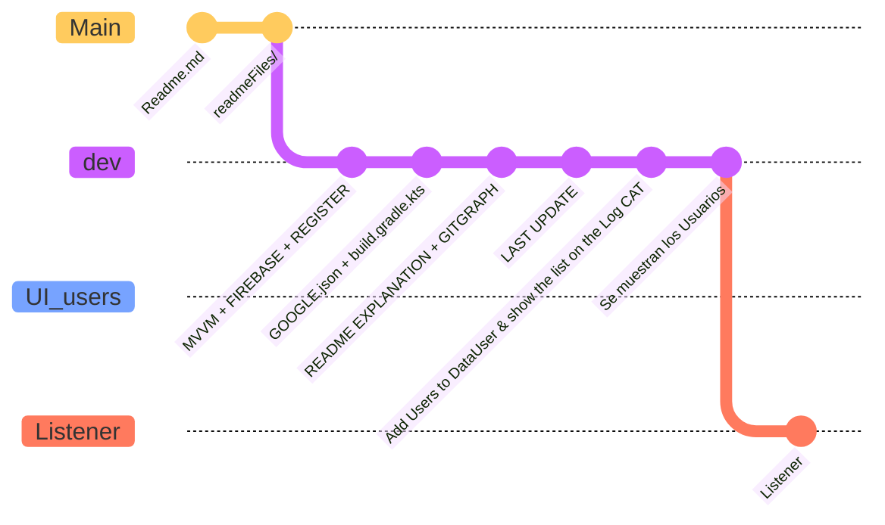

# PROGRAMANDO CON MVVM & FIREBASE

Model viewModel View

Bien una vez configurada la base de datos y descargado el archivo **json** ya podemos empezar a programar.

las estructura de datos sera la siguiente:


``` mermaid
graph TD
    subgraph Firebase
        A(User) -->|DataClass| B(UserData)
        A --> C{Repository}
        C -->|Singleton| D[Repository]
        D -->|Methods| E(GetData, UpdateData, ...)
    end

    subgraph ViewModel
        F[ViewModel] -->|Dependency Injection| D
        F -->|Methods| G(ProcessData, DisplayData, ...)
    end

    subgraph Views
        H[Registration] -->|Handles User Registration| F
        I[Login] -->|Handles User Login| F
        J[Show] -->|Displays Users| F
        K[Update] -->|Updates Users| F
    end

``````
## LISTENER
Bien hemos substituido el código Anterior para hacer una función que sea un Listener,
Esta nos permitirá actualizar los cambios cada Rato, por lo que si desde un dispositivo se crea un nuevo usuario
desde otro dispositivo se actualizará el usuario

Para ello en la clase Model se ha substituido la Función Antigua **getUsers** por un Listener:


esta función crea un flujo que emite listas de usuarios cada vez que hay un cambio en la colección "users" de Firestore. Además, se encarga de manejar errores y cerrar adecuadamente el flujo cuando sea necesario.

**FUNCION EN EL MODEL**

``` Kotlin
    /**
     * Creates a callback flow for listening to changes in the "users" collection in a Firestore database.
     */
    fun listenForUserChanges() = callbackFlow<List<User>> {
        // inicializa el listener
        val listener = database.collection("users")
            .addSnapshotListener { snapshot, exception ->
                if (exception != null) {
                    close(exception)
                    return@addSnapshotListener
                }
                val users = snapshot?.documents?.mapNotNull { document ->
                    document.toObject(User::class.java)
                } ?: emptyList()
                trySend(users).isSuccess
            }
        awaitClose { listener.remove() }
    }
```
**FUNCION EN EL VIEWMODEL**

Bien para que la funcion anterior tenga Efecto, debemos crear una instancia de la misma en el **viewModel** de manera que
pudamos realmente estar escuchando todo el rato de la base de datos.

EN la siguiente funcion creamos una corrutina que nos brinda **viewModel** esto hace que el código funcione
de manera Asincrona y no se nos pare la aplicacionc ada vez que se accede a la base de datos.

Tras obtener todos los datos llamando a la función del **MODEL**  guardamos la lista de usuarios obtenidos en 
Un **MutableState de tipo Lista de Users** para poder acceder a estos datos mas tarde.

Esta función se llamará en la inicialización del **viewModel**

``` kotlin
/**
     * Al inicializar el viewModel en el MainActivity.kt
     * se cargará las funciones que llamemos desde el init
     */
    init{
        listenForUserChanges()
    }

    private fun listenForUserChanges() {
        viewModelScope.launch {
            // Escucha cambios en la colección de usuarios
            model.listenForUserChanges().collect { userList ->
                // Actualiza la lista de usuarios
                DataUser.users.value = userList
            }
        }
    }

```




